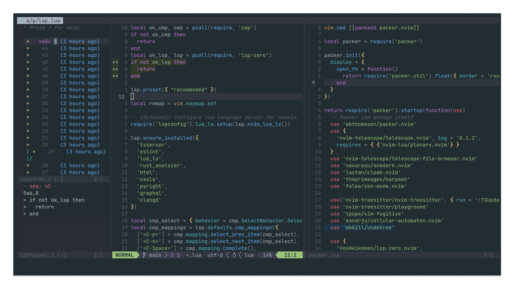

# Another neovim configuration

## Demo

<details>
<summary>Demo in Low Quality 😂</summary>
    
</details>

## Install

1. First Step
```bash
mv ~/.config/nvim ~/.config/nvim.bak && git clone https://github.com/AlphaLawless/nvim-config ~/.config/nvim
```
2. Second Step (WIP)
```bash
~/.config/nvim/bin/uwu
```

## Plugins

- [packer.nvim](https://github.com/wbthomason/packer.nvim) in future I pretend migrate to [lazy](https://github.com/folke/lazy.nvim)
- [telescope.nvim](https://github.com/AlphaLawless/nvim-config)
- [telescope-file-browser](https://github.com/nvim-telescope/telescope-file-browser.nvim)
- [onedark.nvim](https://github.com/navarasu/onedark.nvim)
- [template.nvim](https://github.com/nvimdev/template.nvim)
- [plenary.nvim](https://github.com/nvim-lua/plenary.nvim)
- [lspsaga.nvim](https://github.com/nvimdev/lspsaga.nvim)
- [nvim-autopairs](https://github.com/windwp/nvim-autopairs)
- [cloak.nvim](https://github.com/laytan/cloak.nvim)
- [harpoon](https://github.com/ThePrimeagen/harpoon)
- [zen-mode.nvim](https://github.com/folke/zen-mode.nvim)
- [gitsigns.nvim](https://github.com/lewis6991/gitsigns.nvim)
- [vim-fugitive](https://github.com/tpope/vim-fugitive) Made in VimScript
- [nvim-treesitter](https://github.com/nvim-treesitter/nvim-treesitter)
- [playground](https://github.com/nvim-treesitter/playground)
- [cellular-automato.nvim](https://github.com/Eandrju/cellular-automaton.nvim)
- [undotree](https://github.com/mbbill/undotree) Make in VimScript
- [lsp-zero.nvim](https://github.com/VonHeikemen/lsp-zero.nvim)
- [nvim-lspconfig](https://github.com/neovim/nvim-lspconfig)
- [mason.nvim](https://github.com/williamboman/mason.nvim)
- [mason-lspconfig.nvim](https://github.com/williamboman/mason-lspconfig.nvim)
- [nvim-cmp](https://github.com/hrsh7th/nvim-cmp)
- [cmp-nvim-lsp](https://github.com/hrsh7th/cmp-nvim-lsp)
- [LuaSnip](https://github.com/L3MON4D3/LuaSnip)
- [lualine.nvim](https://github.com/nvim-lualine/lualine.nvim)
- [nvim-web-devicons](https://github.com/nvim-tree/nvim-web-devicons)
